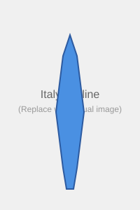
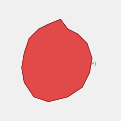

# Question

Which country is this?

## Options
- France
- Italy *
- Greece
- Spain

---

# Question

Which country is this?

## Options
- France *
- Spain
- Germany
- Italy

---

# Question
What is the capital of Norway?

## Options
- Stockholm
- Copenhagen
- Oslo *
- Helsinki
